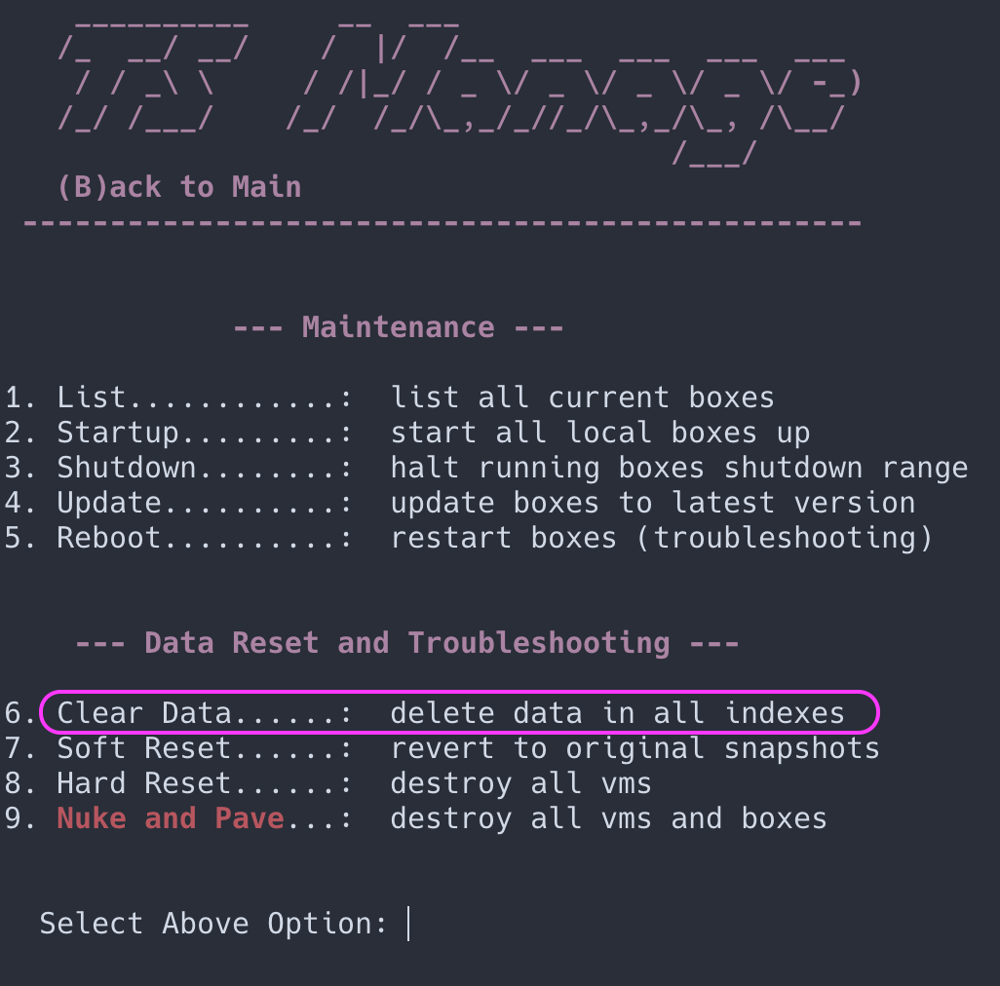

# Demonstration Threat

Now that all VMs are up and running, let's validate that everything is working as it should. Let's get ready to rumble!

<br>
<p align="center">

</p>
<br>

## Functions Check

This functions check will demonstrate a general workflow using some of the major tools available, as well as validate that all nodes are communicating corectly.

1. From your terminal run $ `vagrant ssh ts.elastomic` to establish as shell session on the combo logger / attacker box. Your prompt will update to indicate you're connected to the elastomic box.

1. Then, enter `pwsh` to drop into a Powershell session. Now it is time to choose what test or attack you would like to run against the remote Windows 10 box. You'll see your prompt change to `PS /home/vagrant> `.

1. You can browse the available tests by referencing the [Atomic Redteam Docs](https://github.com/redcanaryco/atomic-red-team/blob/master/atomics/Indexes/Indexes-Markdown/windows-index.md).

1. For this demonstration we will conduct a simple example technique and test. It will use Powershell to download [Mimikatz](https://github.com/gentilkiwi/mimikatz) and then dump credentials on the system. More info about this specific technique and test can be found here:  [T1059.001 TestNumber 1](https://attack.mitre.org/techniques/T1059/001/)

1. Before we can run this test ___against the Windows 10 box___ we first need to setup a Powershell Session over SSH to the Windows 10 box.

1. Create a necessary variable by running the below command. Enter "yes" and the password `vagrant` if prompted:

    ```powershell
    $sess = New-PSSession -Hostname 192.168.33.11 -Username vagrant
    ```

    !!! info "Info"
        What does this do? We are creating a variable called `$sess` and setting it's value to our new session we just created using the [New-PSSession](https://docs.microsoft.com/en-us/powershell/module/microsoft.powershell.core/new-pssession?view=powershell-7.1) Powershell cmdlet.

1. Take a moment to look at the syntax we're going to use to launch our "attack" against the remmote target (`ts.windows10`):

    ```powershell
    Invoke-AtomicTest     # Run Atomic Test
    T1059.001             # Technique ID
    -TestNumbers 1        # TestNumber
    -Session $sess        # Connect using our session variable
    ```

1. Run the following command to kick things off:

    ```powershell
    Invoke-AtomicTest T1059.001 -TestNumbers 1 -Session $sess
    ```

1. Once this is finished, go back to the Discover tab in Kibana: `http://localhost:5601/app/discover#/`

1. In the search bar type "`mimikatz`" and hit Enter. You should see results filtered to show the events matching the Mimikatz attack you just executed.

<br>
<p align="center">

</p>
<br>

!!! tip "Tip"
    Your simple KQL query for "Mimikatz" is case-insensitive, but ensure that your timepicker is set to something sensible like "Today" or "Last 15 minutes". Kibana is (rightfully) ***very picky*** about time. 


## Reset Button

Clean logs -- clean mind right? While the data in Kibana is separated by the fact that it's time-series data, it can be helpful to clear previous attacks and leftover artifacts, especially in an education setting. Let's talk about how to hit the reset button.

#### Target Systems

!!! info "Info"
    The term "target systems" refers to the `ts.windows10` and `ts.centos7` boxes.

Most of (if not all) Atomic Red Team tests come with a cleanup command to clear your target system before executing another test.

1. In order to cleanup our Mimikatz test we can run the same command we used to execute it this time with a `-Cleanup` option at the end.

1. Run the following command to clean house:

    ```powershell
    Invoke-AtomicTest T1059.001 -TestNumbers 1 -Session $sess -Cleanup
    ```

#### Attacker / Logger System

The "control" node that is used to perform all attacking and logging operations is the `ts.elatomic` box. We can use the `stationctl` CLI to perform a data reset. This will clear all existing Elasticsearch index data to wipe the slate clean. Station control should be executed from the vagrant/ folder, so ***ensure*** that you're in the right folder: `<THIS-PROJECT-REPO>/vagrant/`.

1. You can perform a "Clear Data" operation with the following commands:

    * Start CLI: $ `./stationctl`
    * Enter option #4: `Management:  tune and troubleshoot`
    * Enter option #6: `Clear Data:  delete data in all indexes`




## Next Steps

Now that we've passed the functions check and you're able to dig into all of the events, you can jump right into building [detections](https://github.com/elastic/detection-rules) based off of the logs produced using Thremulation Station. You can then run the test again to verify your detection logic is sound.

As for next immediate steps, you have a few options:


#### Toolset Section

If you'd like to dig deeper into all the tools that have been made available in Thremulation Station, head over to the [Toolset](../toolset/index.md) section in the top navigation bar. There you will find details and user walkthroughs on some of the most important tools in the belt.


#### Hunting Handbook

If you're ready to embark on a start-from-nothing guided journey on how to learn host-based threat hunting, check out the [Hunting Handbook](../handbook/what-is-threathunting.md). While it's primary focus is to ramp new analysts and learners, there are plenty of great information useful to everyone.


#### Lone Wolf

If you already know what you're doing, and know what you want TS to do for you, help us by doing great things and [contributing to the project](https://github.com/thremulation-station/thremulation-station/blob/devel/CONTRIBUTING.md)!


## Conclusion

Regardless of the path you choos, congrats! You executed your first test and hopefully took some notes on how the project works.


