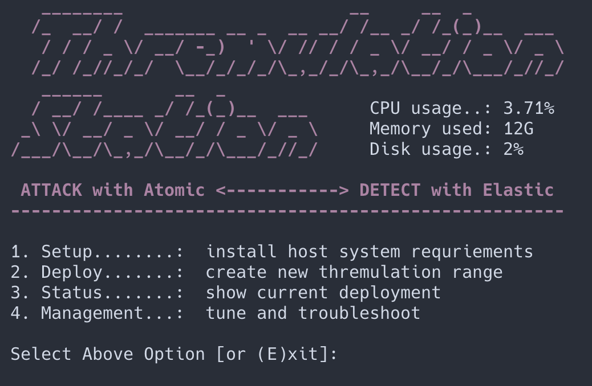
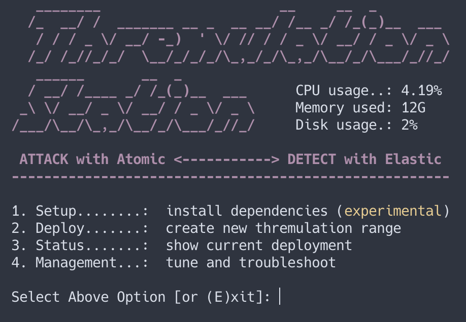
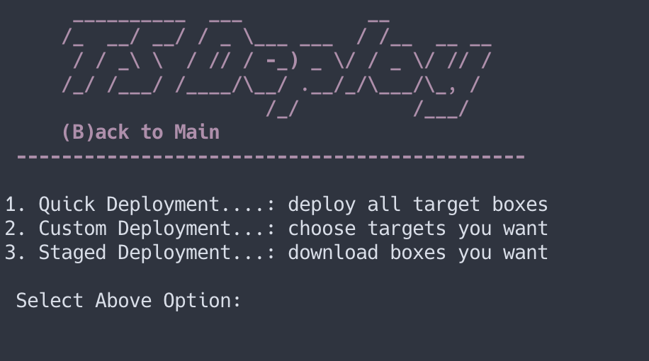

# Deployment

Once you have all the requirements installed and repo staged locally, it's time to deploy 
your threat hunting range.

## Introduction to Station Control

Thremulation Station comes with a terminal control interface called `stationctl`. It is used to perform most major tasks within the environment. The main features provided are:

 

> `stationctl` is a script located in the vagrant/ directory, and must be executed from that folder to work properly

TODO IMG

- configure and deploy a new local range
- check the status of a current range
- management tasks on a current range
    - reloading / rebuilding boxes
    - data reset (clearing indexes)
    - various troubleshooting steps

Let's continue setting up a local testing range by moving into the deployment steps.

### Deployment Options

In the previous section you installed requirements and cloned the repo locally. Let's get this thing going!

1. Move into this repo's vagrant directory. Example: `cd thremulation-station/vagrant`

1. Run the `stationctl` control script. Example: $ `./stationctl`

1. Select option `1` and `<enter>` to move into the deploy menu

Here you can see the main menu and it's options. From here, you have 2 paths you can take...

#### Quick Deployment

A Quick Deployment is the first and fastest option. It enables all VMs included in the range, meaning the control machine and both a windows and linux target box.

1. Select option `1` and `<enter>`

1. Then confirm this configuration to kick things off. This will download boxes / spin up / provision all boxes.

1. Get yourself some fresh coffee, this will take 10-20 min depending on your connection.

 

> **Note:** This is a bandwidth-intensive task that may take a while. But take heart, this will only happen the first time you deploy. Get some coffee, and drink you cup slowly, savoring these infrequently quiet moments.

> **Note: Note:** If you don't drink coffee, I don't trust you and I don't want you to have any part of this.

#### Custom Deployment

TODO

